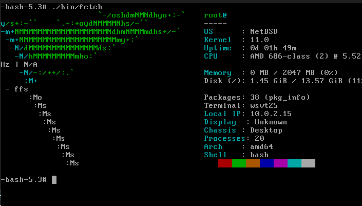
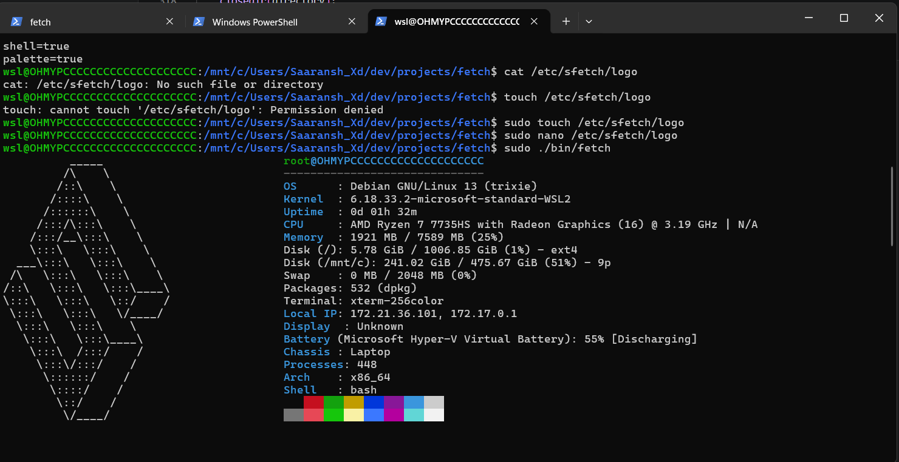

# sfetch

The endgame of fetch programs

A fast, lightweight, cross-platform system information fetch tool for Unix-like systems.

## Install

Install globally on a Unix-like system with:

```sh
curl -fsSL https://raw.githubusercontent.com/Saaransh-Xd/fetch/main/install.sh | sudo bash
```

The installer downloads the release binary, installs `sfetch` to
`/usr/local/bin`, installs logos to `/usr/local/share/sfetch/assets`, and
creates `/etc/sfetch/config` if it does not already exist. Set
`SFETCH_VERSION` to install another release.

## Usage

```sh
sfetch
sfetch --no-logo
sfetch --logo arch
```

Toggle output sections in `/etc/sfetch/config` with `true` or `false`, for
example:

```ini
logo=true
cpu=true
gpu=true
memory=true
disks=true
battery=true
palette=false
```

Place a non-empty custom logo in `/etc/sfetch/logo`. An empty or missing file
uses the detected distro logo instead.

## Screenshots




