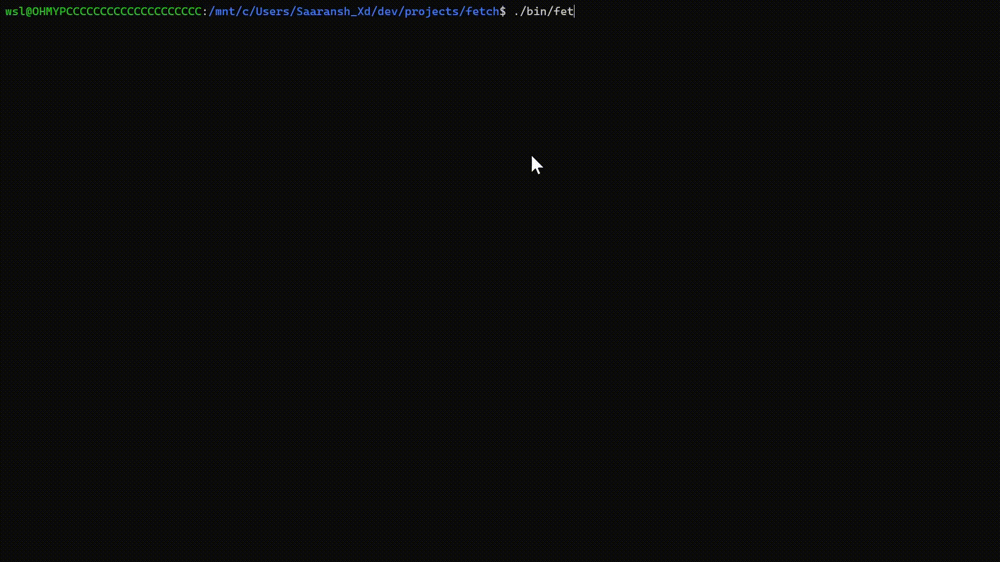

# larpfetch

> [!WARNING]
> BSD platforms are no longer supported (it may work but mostly it would break if you want bsd support either use v0.3 or below or 𝖿̶𝗎̶𝖼̶𝗄̶ fork off)

The endgame of fetch programs

A fast, lightweight, cross-platform system information fetch tool for Unix-like systems.



## Install

Install globally with the platform-dispatching installer:

```sh
curl -fsSL https://raw.githubusercontent.com/Saaransh-Xd/larpfetch/main/install.sh | bash
```

The installer selects the correct release binary automatically:

| Platform | Architecture | Release Articaft (named sfetch for compatiblity) |
| --- | --- | --- |
| Linux | x86_64/amd64 | `larpfetch-x86_amd64-linux` |
| FreeBSD, OpenBSD, NetBSD, DragonFly BSD (no longer supported use v0.3 or below) | x86_64/amd64 | `larpfetch-x86_amd64-bsd` |
| macOS | arm64/aarch64 | `larpfetch-arm64-applesilicon-macos` |
| macOS | x86_64/amd64 | `larpfetch-macos-x86_amd64` |

When working from a checkout, the platform-specific scripts can also be run
directly: `install-linux.sh`, `install-bsd.sh`, or `install-macos.sh`.

The installer downloads the release binary and ASCII assets, installs `larpfetch`
to `/usr/local/bin`, creates the `fetch` alias, and creates
`/etc/larpfetch/config` only when it does not already exist. Run as root or use a
user account with `sudo` available. Set `LARPFETCH_VERSION` to install another
release, or set `larpfetch_BINARY_URL` to override the binary URL.

## Usage

```sh
larpfetch
larpfetch --classic
larpfetch --classic --no-logo
larpfetch --logo arch
larpfetch --json
larpfetch --larp
```

LARP is the default presentation. `--classic` selects the original native
fetch output, while `--larp` explicitly selects LARP. LARP starts the
application in `larp/` inside an embedded CPython
interpreter. The C program injects its collected system information into
Python as `larpfetch_info`. LARP renders a shaded, rotating distro logo beside
that data. It requires CPython development files when building.

LARP options include `--logo NAME_OR_PATH`, `--frames N` (default: 48), `--infinite`, `--speed N`, `--fps N`, `--blocks`,
`--shading-chars TEXT`, `--no-color`, `--box`, `--version`, `--eval EXPR`,
and `--interactive`.

`--json` prints the collected system information as JSON instead of the
stylized side-by-side output, suitable for scripting:

Toggle output sections in `/etc/larpfetch/config` with `true` or `false`, for
example:

```ini
logo=true
cpu=true
gpu=true
memory=true
disks=true
battery=true
palette=false
```

Place a non-empty custom logo in `/etc/larpfetch/logo`. An empty or missing file
uses the detected distro logo instead.
